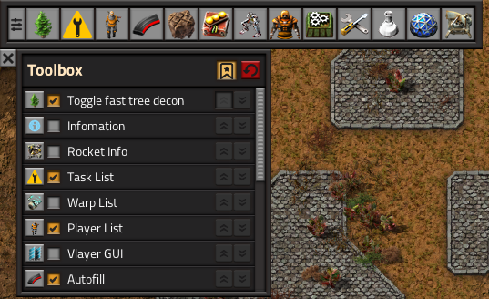

# ExpGui Framework Guide

This guide presents best practices for creating GUIs in Factorio and demonstrates how the ExpGui framework can help streamline development.
If you’re new to GUI creation in Factorio, we recommend starting with [Therenas' helpful tutorial](https://github.com/ClaudeMetz/UntitledGuiGuide/wiki) to build a solid foundation.
We also recommend [Raiguard's style guide](https://man.sr.ht/~raiguard/factorio-gui-style-guide/) if you are looking to mimic the design principles employed by the game's own guis.

Additional details for the methods available in this library can be found in the [api reference](./docs/reference.md).

All examples in this guide assume you are using popular VSCode extensions for Factorio development, such as FMTK (`justarandomgeek.factoriomod-debug`) and LuaLs (`sumneko.lua`).

## Motivation

This section explains the motivation behind the framework and the thinking that shaped its design.
A full breakdown of my thoughts can be found in the [motivation document](./docs/motivation.md).

It began with a frustration I had using existing libraries, which often required separating elements, event logic, and data into different parts of the codebase.
While that may work for some, I found it unintuitive and overly sparse; jumping between element definitions and event handlers became tiring.
I wanted something that felt more cohesive, where all the code for a GUI component could live in one place, and where data and behaviour were naturally scoped to that component.

The result is a framework built around four focused modules: [ExpElement](./docs/motivation.md#expelement), [GuiData](./docs/motivation.md#guidata), [GuiIter](./docs/motivation.md#guiiter), and [Toolbar](./docs/motivation.md#toolbar).
Each part solves a specific problem but is designed to work seamlessly with the others.
Additionally, naming conventions and calling patterns play a key role in this framework; they’re not just style preferences, but fundamental to how everything fits together conceptually.

The goal throughout has been to reduce boilerplate, increase clarity, and make GUI development feel more natural.
If you’ve ever felt like writing GUI code was harder than it needed to be, this framework might be what you’re looking for.

## Glossary

- "element": A `LuaGuiElement` instance representing a GUI component in Factorio.
- "element definition": An instance of `ExpElement` containing the details and logic for creating a GUI element.
- "element method": A custom method added to an element definition, the first argument should be a LuaGuiElement belonging to the definition.
- "gui event handler": A function called in response to a GUI-specific event (e.g., a button click).
- "event handler": A function called in response to any event occurring in the game.
- "gui data": Persistent data stored and accessed by GUI event handlers, typically linked to specific elements.
- "pre-defined element": An element provided by the framework that includes built-in styles and layout logic for common GUI patterns.
- "draw function": A function defined within an element definition that constructs and returns the corresponding `LuaGuiElement`.
- "draw table": A plain Lua table used as a shorthand for a draw function, typically employed when no dynamic logic or nested elements are required.
- "toolbar": A shared GUI area for displaying module buttons, often positioned at the top-left of the screen.
- "cache": Temporarily stored computed data used to avoid repeated expensive calculations; cached variables are often prefixed with an underscore to indicate they should not be accessed directly.

### Naming conventions

- `Elements`: A common local variable name used to store returned element definitions from a GUI module, capitalised to avoid shadowing more generic variable names like `elements`.
- `Elements.container`: A common name for the variable holding the root element definition, especially when registering it to be drawn on the left flow.
- `scroll_table`: A built-in composite element in the framework designed to display tabular data with scrolling support.
- `calculate`: A method that generates the data required to draw or refresh GUI elements.
- `refresh`: A method that updates the GUI elements to reflect the current data without fully reconstructing the interface.
- `link`: A method used to associate elements with data or other elements after initial creation.
- `element_data`: A lua table containing all data required to draw or refresh an specific element.
- `row_elements`: A lua table containing all elements in a row of a gui table.
- `row_data`: A lua table containing all data required to draw or refresh a row of a table.
- `add_row`: A method added to table element definitions that appends a single row based on provided data.
- `tooltip-`: Prefix used for locale string keys to indicate their intended display location, improving clarity and organisation. Others include `caption-` and `error-`

## The boiler plate

### Tip 1: Use `event_handler.add_lib`

When working with multiple GUI modules, it's a good practice to use `event_handler.add_lib` to register them.
This approach helps avoid conflicts between event handlers and makes it easier to scale your mod's interface across different components.
`event_handler` is a core lualib provided by factorio, it's full path is `__core__.lualib.event_handler` but should be required as `event_handler`

The ExpGui framework relies on this same mechanism to register your GUI event handlers, so following this pattern ensures compatibility and consistency.

By organising your code into libraries and registering them via add_lib, you also improve modularity; making it easier to reason about each part of your GUI separately and debug issues when they arise.

```lua
local add_lib = require("event_handler").add_lib
add_lib(require("modules/your_module/gui_foo"))
```

### Tip 2: Return your element definitions

Each GUI module should return its element definitions as part of its public interface.
Doing so offers two major advantages:

- It makes debugging easier; you can inspect the associated GUI data stored for each element definition, which helps track down issues with state or layout.
- It allows your definitions to be reused across other modules, encouraging modularity and reducing duplication.

Following both Tip 1 and Tip 2 gives you a clean boilerplate structure for starting any GUI module.
In most cases, the returned definitions are assigned to a local variable named `Elements` (capitalised).
This helps avoid naming conflicts with local variables like `elements`, which are commonly used within the same scope.

```lua
local ExpUtil = require("modules/exp_util")
local Gui = require("modules/exp_gui")

--- @class ExampleGui.elements
local Elements = {}

local e = defines.events
return {
    elements = Elements,
    events = {

    },
    on_nth_tick = {

    },
}
```

## Creating a root element

### Tip 3: Register a single root element definition to be drawn when a player is created

Most GUI modules are built around a single root element; an element that contains all other child elements and acts as the entry point to your interface.

In typical usage, you’ll want this root element to be created automatically when a new player joins the game because it allows for a persistent GUI state.
Manually creating it in your own `on_player_created` handler can lead to redundant code and inconsistency.

Instead, the framework provides a way to register your root element definition, and it will handle drawing it for every newly created player.
This ensures the element is always present and your GUI state is initialised properly without extra boilerplate.

To create a new element definition you should call `Gui.define` with the name of your element, this name must be unique within your mod.
In the below example `Elements.container` is defined, this will be expanded in the next tip as all defines should have a draw method rather than using empty.

```lua
--- The root element of the example gui
Elements.container = Gui.define("container")
    :empty()

--- Add the element to the left flow with it hidden by default
Gui.add_left_element(Elements.container, false)
```

### Tip 4: Use pre-defined elements as a starting point

The framework includes several [pre defined elements](./module/elements.lua) that help maintain a consistent appearance and layout across GUI modules.
These elements simplify the process of creating common interface structures while encouraging visual consistency throughout your mod.

When using a pre defined element, or when defining your own element that contains other elements, you should include a `draw` method in the element definition.
This method is responsible for building the GUI structure at runtime.
The return value is used by the framework to attach event handlers and track elements, after which it is given to the caller.

For left side frames, such as in the example module, the `container` element is a good place to start.
It provides a standard layout that works well for persistent side panels.

```lua
Elements.container = Gui.define("container")
    :draw(function(def, parent)
        -- def is self reference to the element definition
        -- parent is where you should add your new element

        -- to create an element you call its definition passing a parent element
        local container = Gui.elements.container(parent)

        -- header is another common pre-defined element, footer exists too
        -- note, adding custom draw arguments will be covered later
        local header = Gui.elements.header(container, {
            caption = { "example-gui.caption-main" }
        })

        -- for elements registered to be drawn on join, the root element should be returned
        -- note that container.parent ~= parent because container is a composite element, so use get root
        return Gui.elements.container.get_root_element(container)
    end)
```

### Tip 5: Use the toolbar for buttons

The framework includes a shared toolbar that allows GUI modules to register buttons in a consistent and user friendly way. These buttons follow a standard style and layout, helping your interface stay visually unified across modules.
The toolbar also supports player customisation via the toolbox.
Players can choose which buttons are visible and rearrange their order according to personal preference.



A toolbar button does not require a `left_element`, but if one is provided, the framework will automatically register an `on_click` handler.
This handler toggles the visibility of the named element.
You can optionally define a `visible` function as part of the button definition.
This function is called when the button is first drawn and determines whether a specific player is allowed to see the button.

```lua
Gui.toolbar.create_button{
    name = "toggle_example_gui",
    sprite = "item/iron-plate",
    tooltip = { "example-gui.tooltip-main" },
    left_element = Elements.container,
    visible = function(player, element)
        -- this button will only be visible to admins
        return player.admin
    end,
}
```

## Receiving user input

### Tip 6: For simpler elements use draw tables

If an element does not contain any child elements and all of its properties are static, you can define it using a draw table instead of a full function.

A draw table is simply a Lua table that describes the structure and properties of a single GUI element.
The framework automatically converts this into a draw function internally, making it a convenient shorthand for simple elements.
A direct comparison of the two can be found in the [motivation section](./docs/motivation.md#expelement).

This approach helps reduce boilerplate and improves readability when creating basic buttons, labels, flows, or other standalone GUI elements.

### Tip 7: Table definitions also work for applying styles

Styles can be applied to an element using the `:style(function(def, parent, element) end)` method.
However, for simpler elements like buttons and labels, you can also define the style directly as a table.

This shorthand approach allows you to include static style properties (such as font, padding, or alignment) in the same table format used to define the element itself.
It helps keep simple element definitions concise and easy to read.

### Tip 8: Use gui event handler methods

Instead of writing separate event handlers and manually routing events, you can define GUI event handler methods directly on your element definitions.
The framework will automatically register these methods and filter incoming events, calling the correct handler based on the element involved.

This approach simplifies your code by keeping the event logic close to the element it concerns.
It also reduces boilerplate and improves maintainability by leveraging the framework’s built-in event dispatch system.

All gui event handlers are supported following the naming convention of `on_gui_click` -> `on_click`

```lua
Elements.example_button = Gui.define("example_button")
    :draw{
        caption = "Hi",
        tooltip = { "example-gui.tooltip-example-button" },
        -- string styles are applied during draw
        style = "shortcut_bar_button",
    }
    :style{
        size = 24,
    }
    :on_click(function(def, player, element, event)
        player.print("Hello, World!")
    end)

-- within Elements.container:draw
Elements.example_button(header)
```

## Displaying data

### Tip 9: Scroll tables are your friend

Displaying data in a scrollable table is a common GUI pattern, and this framework includes a pre defined composite element specifically for this purpose.

In the upcoming examples, you will see type annotations used with the element definitions.
These annotations are necessary due to limitations in LuaLS, including the explicit type casts (using as) used to help the language server correctly interpret overloaded functions.

```lua
--- @class ExpGui_Example.elements.display_table: ExpElement
--- @overload fun(parent: LuaGuiElement): LuaGuiElement
Elements.display_table = Gui.define("display_table")
    :draw(function(def, parent)
        -- 2nd arg is max vertical size, 3rd arg is column count
        return Gui.elements.scroll_table(parent, 200, 3)
    end) --[[ @as any ]]
```

### Tip 10: Separate data calculation and drawing

To avoid repeating code, it’s best to calculate the data you want to display in a separate function from the one that creates the row elements.

This separation makes your code cleaner and more modular.
It also allows you to reuse the calculated data in other methods such as `refresh`, where the GUI needs to update without rebuilding everything from scratch.

The return type of this function will typically be a collection of locale strings and other values that will be displayed in your GUI.
For tables, this should be named `row_data` but other elements should be `display_data` or include more specific details like `team_data`.
The value should then be passed to create or refresh an element or table row, tip 14 has an example of this.
For intensive calculations called frequently, you can incorporate passing a previous table allocation, see second example.

```lua
--- @class Elements.display_table.row_data
--- @field name string
--- @field sprite string
--- @field caption LocalisedString
--- @field count number

--- @param inventory LuaInventory
--- @param item_name string
--- @return Elements.display_table.row_data
function Elements.display_table.calculate_row_data(inventory, item_name)
    return {
        name = item_name,
        sprite = "item/" .. item_name,
        name = { "item-name." .. item_name },
        count = inventory.get_item_count(item_name)
    }
end

--- @param inventory LuaInventory
--- @param item_name string
--- @param row_data Elements.display_table.row_data
--- @return Elements.display_table.row_data
function Elements.display_table.calculate_row_data(inventory, item_name, row_data)
    row_data = row_data or { name = {} }
    row_data.name = item_name
    row_data.sprite = "item/" .. item_name
    row_data.name[1] = "item-name." .. item_name
    row_data.count = inventory.get_item_count(item_name)
    return row_data
end
```

### Tip 11: Use a function to add rows rather than an element define

Element definitions are intended for creating single elements or composite elements with a clear structure.
When they are used to create multiple rows in tables, managing data ownership and state can become confusing.

To keep your code clean and your data flow clear, it’s recommended to extend your table element definition with an `add_row` method.
This method handles adding new rows one at a time, keeping row creation logic separate from element definition and making it easier to manage dynamic content.
Tip 14 shows an example of `add_row` being used within the container draw function.

### Tip 12: Store row elements in gui data

When adding elements to a row, you will often need to reference those elements later for updates or interaction.

To manage this, use gui data to store references to these elements.
The framework provides a convenient initialiser method, `:element_data{}`, which creates an empty table at `def.data[element]`.
This table can be used to store per-row GUI element references or other related data.

For good encapsulation, it is best practice to access gui data only within the methods of the element definition it belongs to.
This keeps your data management organised and reduces the risk of unintended side effects.

```lua
--- @class Elements.display_table.row_elements
--- @field sprite LuaGuiElement
--- @field label_name LuaGuiElement
--- @field label_count LuaGuiElement

--- @param display_table LuaGuiElement
--- @param row_data Elements.display_table.row_data
function Elements.display_table.add_row(display_table, row_data)
    local rows = Elements.display_table.data[display_table]
    assert(rows[row_data.name] == nil, "Row already exists")

    local visible = row_data.count > 0
    rows[row_data.name] = {
        sprite = display_table.add{
            type = "sprite",
            sprite = row_data.sprite,
            visible = visible
        },
        label_name = display_table.add{
            type = "label",
            caption = row_data.name,
            visible = visible
        },
        label_count = display_table.add{
            type = "label",
            caption = tostring(row_data.count),
            visible = visible
        },
    }
end
```

## Refreshing displayed data

### Tip 13: Use 'refresh' functions to optimise updates

Instead of clearing and rebuilding the entire table every time it changes, it’s more efficient to update the existing GUI elements directly.

To keep your code clean and modular, place this update logic inside a `refresh` function.
This function adjusts the current elements to match the new data state without unnecessary reconstruction.
You may also encounter variants like `refresh_all`, `refresh_online`, `refresh_force` to indicate different scopes or contexts for the update.

```lua
--- @param display_table LuaGuiElement
--- @param row_data Elements.display_table.row_data
function Elements.display_table.refresh_row(display_table, row_data)
    local row = assert(Elements.display_table.data[display_table][row_data.name])
    row.label_count.caption = tostring(row_data.count)

    local visible = row_data.count > 0
    for _, element in pairs(row) do
        element.visible = visible
    end
end
```

### Tip 14: Pass references rather than names

Instead of using element names to identify GUI elements, it’s better to pass direct references to those elements whenever possible.
Using references reduces the impact of GUI restructuring and improves performance by avoiding lookups.
However, be cautious not to use references to elements that might be destroyed, as this can lead to invalid references and crashes.

To maintain encapsulation and avoid tight coupling, passing references often means you’ll need to design your methods to accept custom arguments explicitly.
For example, updating a button’s event handler to receive element references directly rather than traversing the GUI tree.

```lua
--- @class ExpGui_Example.elements.example_button: ExpElement
--- @field data table<LuaGuiElement, LuaGuiElement>
--- @overload fun(parent: LuaGuiElement, display_table: LuaGuiElement): LuaGuiElement
Elements.example_button = Gui.define("example_button")
    :draw{
        caption = "Refresh",
        tooltip = { "example-gui.tooltip-example-button" },
        style = "shortcut_bar_button",
    }
    :style{
        size = 24,
    }
    :element_data(
        -- Set the element data to the first argument given
        Gui.from_argument(1)
    )
    :on_click(function(def, player, element, event)
        --- @cast def ExpGui_Example.elements.example_button
        local display_table = def.data[element]
        for _, item_name in pairs{ "iron-place", "copper-plate", "coal", "stone" } do
            local row_data = Elements.display_table.calculate_row_data(inventory, item_name)
            Elements.display_table.refresh(display_table, row_data)
        end
    end) --[[ @as any ]]

-- within Elements.container:draw
local inventory = Gui.get_player(container).get_main_inventory()
local display_table = Elements.display_table(container)
for _, item_name in pairs{ "iron-place", "copper-plate", "coal", "stone" } do
    local row_data = Elements.display_table.calculate_row_data(inventory, item_name)
    Elements.display_table.add_row(display_table, row_data)
end

Elements.example_button(header, display_table)
```

### Tip 15: Use the custom gui iterator to optimise refreshes

When your data requires frequent updates, whether triggered by events or on every nth game tick, it’s efficient to use the framework’s custom GUI iterator.
This iterator filters and returns only the specific elements that need refreshing, reducing unnecessary work.

To enable this, you must tell your element definition which GUI elements to track.
In most cases, calling `:track_all_elements()` is sufficient to track all relevant elements automatically.

For updates that happen every nth tick, it’s better to use `:online_elements()` instead of `:tracked_elements()`.
The `online_elements()` iterator returns only elements associated with players currently online, which helps avoid updating GUI elements for disconnected players unnecessarily.

```lua
--- @param event EventData.on_player_main_inventory_changed
local function on_player_main_inventory_changed(event)
    local player = assert(game.get_player(event.player_index))
    for _player, display_table in Elements.display_table:tracked_elements(player) do
        for _, item_name in pairs{ "iron-place", "copper-plate", "coal", "stone" } do
            local row_data = Elements.display_table.calculate_row_data(inventory, item_name)
            Elements.display_table.refresh(display_table, row_data)
        end
    end
end
```

## Miscellaneous

### Tip 16: Don't set sizes and instead use horizontally stretchable

Rather than explicitly setting fixed sizes on GUI elements, it is better to leave sizes undetermined and enable the horizontally stretchable property on the appropriate elements within your GUI.
You don’t need to set this property on every element, only on those that are at the deepest level of your GUI hierarchy where flexible spacing is required.

A common and effective use case is employing stretchable empty widgets to create flexible space between elements.
This approach leads to cleaner, more adaptive layouts that adjust gracefully to different languages.

### Tip 17: Cache data where possible

If the data you display is common to all players on a force or surface, it’s best to cache this data rather than recalculating it for each player individually.

You can store cached data as a local variable within a `refresh_all` function to limit its scope and lifetime. Alternatively, if you’re confident in your data management, you may cache it in a higher scope to reuse across multiple refresh cycles.
Be cautious when caching in higher scopes, as improper management can lead to desyncs issues between players.

```lua
function Elements.unnamed_element.refresh_all()
    local force_data = {}
    for player, unnamed_element in Elements.unnamed_element:online_elements() do 
        local force = player.force --[[ @as LuaForce ]]
        local element_data = force_data[force.name] or Elements.unnamed_element.calculate_data(force)
        force_data[force.name] = element_data
        Elements.unnamed_element.refresh(unnamed_element, element_data)
    end
end
```

```lua
local _force_data = {}
function Elements.here_be_desyncs.get_data(force)
    local data = _force_data[force.name] or Elements.here_be_desyncs.calculate_data(force)
    _force_data[force.name] = data
    return data
end
```

### Tip 18: Use named arguments when many are optional

For elements like `header` that have many optional arguments, it is better to provide those arguments as named values in a table rather than relying on positional order.
This can be done by passing a string key to `Gui.from_argument("key_name", default_value)`, which treats the final argument as a table of named parameters.

Positional arguments still support default values, but using named arguments improves readability and reduces errors when many options are involved.

```lua
--- @class ExpGui_Example.elements.label: ExpElement
--- @overload fun(parent: LuaGuiElement, opts: { caption: string?, width: number? }): LuaGuiElement
Elements.label = Gui.define("label")
    :draw{
        caption = Gui.from_argument("caption"),
    }
    :style{
        width = Gui.from_argument("width", 25),
    } --[[ @as any ]]
```

### Tip 19: Use force and player data within gui data

GUI data is not limited to just individual elements—you can also store and share data at the force or player level.
This allows multiple elements to access common data relevant to a specific player or force, improving consistency and reducing duplication.
Using force and player scoped gui data helps manage state effectively across complex interfaces.

All GUI data initialisers also accept functions, similar to the `:style` method, enabling you to define dynamic starting states that can change based on the current context.

```lua
:force_data{
    clicked_time = 0,
    clicked_by = "No one."
}
:on_click(function(def, player, element, event)
    local force = player.force --[[ @as LuaForce ]]
    local force_data = def.data[force]
    force_data.clicked_time = event.tick
    force_data.clicked_by = player.name
end)
```

### Tip 20: Have clear data ownership

Store GUI data in the highest-level element definition where it is needed, then pass references to child elements.
This allows children to access and modify the shared data as necessary while keeping ownership clear and centralized.

```lua
-- on the settings button
:element_data(
    Gui.from_argument(1)
)

-- on the parent
:draw(function(def, parent)
    local player = Gui.get_player(parent)
    local player_data = def.data[player] or {}
    def.data[player] = player_data

    local flow = parent.add{ type = "flow" }
    for _, setting in pairs(player_data) do
        Elements.settings_button(flow, setting)
    end
end)
```

Sometimes, due to the order in which elements are drawn, passing references at creation time isn’t possible.
In these cases, a `link` method should be used after creation to connect child elements together.
It’s also common to pass a table of elements that can be populated incrementally, helping to manage collections of related GUI components cleanly.

```lua
-- on toggle_enabled
:on_click(function(def, player, element, event)
    --- @cast def ExpGui_Example.elements.toggle_enabled
    local other_element = def.data[element]
    if other_element then
        other_element.enabled = not other_element.enabled
    end
end)

function Elements.toggle_enabled.link_element(toggle_enabled, other_element)
    Elements.toggle_enabled.data[toggle_enabled] = other_element
end

-- on the parent
:draw(function(def, parent)
    local flow = parent.add{ type = "flow" }
    local toggle_enabled = Elements.toggle_enabled(flow)
    local other_button = Elements.other_button(flow)
    Elements.toggle_enabled.link_element(toggle_enabled, other_button)
end)
```
